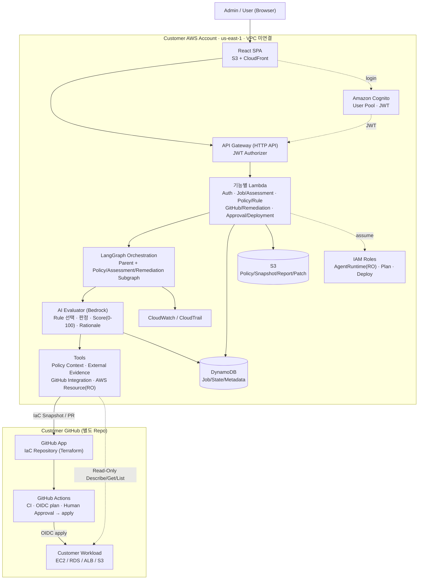

# C4 — Container

이 문서는 C4 Level 2(Container)다. Governance Platform 내부를 배포 단위(Container) 수준으로 보여준다. System Context는 [C4-CONTEXT.md](C4-CONTEXT.md), 상세 책임은 [../DESIGN.md](../DESIGN.md), 기술 선택 근거는 [../decisions/0008-serverless-langgraph-architecture.md](../decisions/0008-serverless-langgraph-architecture.md)를 따른다.

## Container Diagram

## Container별 책임

| Container | 기술 | 책임 |
| --- | --- | --- |
| Frontend | React SPA, S3 + CloudFront | 화면 표시, 권한별 UI 제어(인가 아님), Job Polling |
| 인증 | Amazon Cognito | User Pool, JWT 발급. Admin/User Group |
| API | API Gateway HTTP API + JWT Authorizer | 진입점, 토큰 검증 |
| Backend | 기능별 Lambda | JWT/RBAC, Schema Validation, Job lifecycle, Domain CRUD, Approval, Score 범위·Schema·Coverage 검증 |
| Workflow | LangGraph | Parent Graph 라우팅 + Subgraph, Checkpoint(중단/재개) |
| AI Evaluator | Bedrock | Rule 선택, Evidence 판단, PASS/FAIL/MANUAL/INSUFFICIENT, Severity, Score(0–100), Rationale |
| Tools | Python | Policy Context, External Evidence, GitHub Integration, AWS Resource(Read-Only) |
| Metadata Store | DynamoDB | Job/State/Metadata, 조건부 쓰기(CAS) |
| Artifact Store | S3 | Policy 원문, Snapshot, Report, Patch, content-hash 주소화 |
| Observability | CloudWatch / CloudTrail | Infra + AI Workflow Trace |
| IAM | IAM Roles | AgentRuntime(RO), TerraformPlanRole, TerraformDeploymentRole 분리 |

## 배포 경계

- Frontend/인증/API/Backend/Workflow/AI/Data/IAM은 모두 **고객 AWS Account에 CloudFormation으로 배포**한다.
- Backend Lambda와 Agent Runtime은 **MVP에서 고객 기존 VPC에 연결하지 않는다.**
- Customer GitHub와 Customer Workload는 고객 소유 경계이며, Platform은 GitHub App/OIDC와 Read-Only API로만 접근한다.

## Component 수준 (필요 시)

Component(C4 Level 3)는 필요할 때 `C4-COMPONENT.md`로 추가한다. 현재는 Context/Container 수준으로 충분하다.
