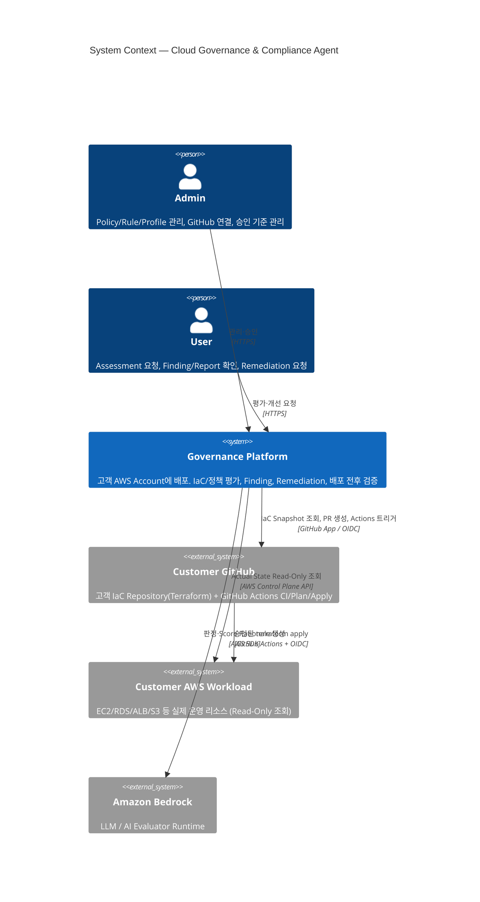

# C4 — System Context

이 문서는 Cloud Governance & Compliance Agent의 C4 Level 1(System Context)이다. 시스템이 누구와, 어떤 외부 시스템과 상호작용하는지 한 장으로 보여준다. 구현 세부는 [C4-CONTAINER.md](C4-CONTAINER.md), 설계 정본은 [../DESIGN.md](../DESIGN.md)를 따른다.

## 개요

Governance Platform은 고객 AWS Account에 배포되어, 고객의 Terraform IaC와 사내 정책·ISMS-P 기준을 AI가 평가하고 개선안을 사람 승인 뒤 배포·재검증까지 연결한다.

## Context Diagram

## 핵심 경계

- **사람**: Admin(관리·승인), User(평가·개선 요청). 인증은 Cognito, 인가는 Backend RBAC.
- **Governance Platform**: 고객 AWS Account 내부에 Customer-Deployed. 평가·Finding·Remediation 생성·오케스트레이션을 담당하되 직접 인프라를 변경하지 않는다.
- **Customer GitHub**: 고객 IaC의 Source of Truth. Platform은 승인된 Repository만 GitHub App으로 접근한다. 실제 `terraform apply`는 Human Approval 이후 GitHub Actions(OIDC)가 수행한다.
- **Customer AWS Workload**: Read-Only(`Describe/Get/List`)로만 관찰한다. Platform과 Agent는 Write 권한이 없다.
- **Amazon Bedrock**: AI Evaluator의 LLM Runtime. 고객 AWS Account 경계 안에서 IAM으로 호출한다.

## 불변 원칙

- Agent Runtime은 Customer Workload에 Read-Only.
- 변경은 Human Approval 이후 GitHub Actions만 수행.
- 데이터·State·배포 권한은 고객 소유.
